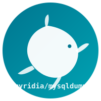

<p align="center">
  
</p>

# mysqldump

Minimal Docker image for dumping MySQL/MariaDB databases. Based on Alpine (~5MB).

## Build

```sh
make build
```

## Usage

### Dump to file

```sh
docker run -i --rm --net=host myridia/mysqldump -h HOST -u USER -pPASS DBNAME | gzip > dump.sql.gz
```

### Dump to stdout

```sh
docker run -i --rm --net=host myridia/mysqldump -h HOST -u USER -pPASS DBNAME
```

### Restore from dump

```sh
zcat dump.sql.gz | docker run -i --rm --net=host myridia/mysqldump -h HOST -u USER -pPASS DBNAME
```

## Examples

```sh
# Dump remote database
docker run -i --rm --net=host myridia/mysqldump \
  -h 95.217.164.232 \
  -u foo \
  -pbarbar \
  dbsql1 | gzip > dbsql1.sql.gz

# Dump with specific port
docker run -i --rm --net=host myridia/mysqldump \
  -h 95.217.164.232 \
  -P 3306 \
  -u root \
  -pPASSWORD \
  mydb > mydb.sql
```
